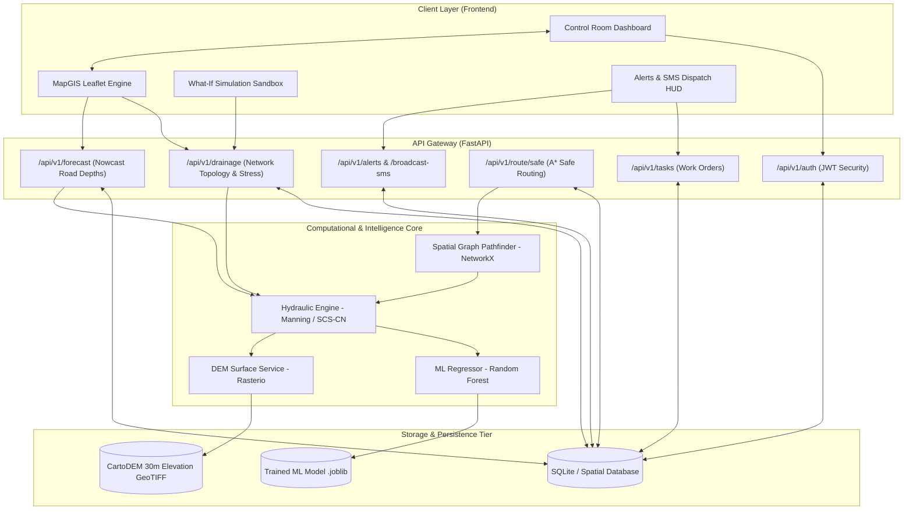

# SIH PROJECT

# UFIS — UrbanFlood Intelligence System
### Smart India Hackathon 2026 | AI-Powered Dynamic Urban Flood Nowcasting & Decision Support Platform

[](https://www.python.org/)
[](https://fastapi.tiangolo.com/)
[](https://react.dev/)
[](https://www.typescriptlang.org/)
[](https://vitejs.dev/)
[](LICENSE)

---

## 1. Project Overview

### What the Project Does
**UFIS (UrbanFlood Intelligence System)** is an integrated, full-stack digital twin and operational decision-support platform designed for urban flood nowcasting and emergency response. It merges high-resolution geospatial data (Digital Elevation Models, stormwater drain networks, manholes, road corridors) with hybrid hydrodynamic physics (Manning's open-channel equation, SCS-CN hydrologic runoff) and machine learning regression models (Random Forest & Gradient Boosting) to forecast localized street-level water depths and conduit drainage stress up to 3 hours in advance.

### The Problem It Solves
Urban flooding in modern metros (such as Bengaluru) is often exacerbated by rapid unplanned urbanization, loss of natural valley connectivity, and underground stormwater conduit bottlenecks. Municipal authorities and disaster managers typically face critical gaps:
1. **Lack of Predictive Visibility:** No foresight into street-level water accumulation before rainfall peaks.
2. **Invisible Underground Conduit Choking:** Zero real-time hydraulic awareness of pipe surcharges and reverse backflows pushing floodwater onto road surfaces.
3. **Emergency Vehicle Stranding:** Ambulances and first responders get stuck in submerged corridors without real-time flood-safe alternate routing.
4. **Delayed Public Warning & Field Action:** Absence of automated, coordinated citizen SMS alerts and targeted field team dispatch.

### Why the Project Was Developed
Developed for the **Smart India Hackathon (SIH) 2026**, UFIS transitions municipal flood management from reactive disaster recovery to proactive, AI-informed nowcasting and mitigation. Using Koramangala (BBMP Ward 151, Bengaluru) as a high-risk urban pilot area, UFIS demonstrates how municipal bodies can forecast inundation, simulate proactive interventions, protect critical infrastructure, and save lives.

### Main Objectives
- **0–3 Hour Hyper-Local Nowcasting:** Predict water depth across individual road corridors at intervals of `NOW`, `+30m`, `+1h`, `+2h`, and `+3h`.
- **Hydraulic Pipe Stress & Backflow Detection:** Simulate conduit capacities, head loss, and backwater surcharge pushing floodwaters upstream onto road surfaces.
- **Flood-Safe Emergency Routing:** Compute dynamic, obstacle-free paths for ambulances and rescue vehicles around submerged corridors.
- **Decision Support & What-If Simulation:** Allow control room operators to test mitigation actions (e.g., clearing silt blockages, adjusting pump flow rates) in real time.
- **Automated Public & Field Communication:** Dispatch instant emergency SMS broadcasts and work orders directly to field teams and citizens.

### Target Users
- **City Disaster Management Authorities & Control Room Operators** (e.g., BBMP, NDMA, SDMA)
- **Municipal Stormwater & Road Infrastructure Engineers**
- **Emergency First Responders** (Ambulance drivers, Fire & Rescue services, Police)
- **Citizens & Urban Commuters**

---

## 2. Features

### Feature 1: Interactive GIS Digital Twin Map
- **What it does:** Provides a real-time, interactive geospatial visualization of the urban catchment, displaying road segments, underground drainage nodes (manholes), conduits (pipes), and stormwater outfalls.
- **How it works:** Visualizes GeoJSON layers using Leaflet and React-Leaflet with terrain-calibrated depth color codes (green = safe, amber = caution, red = severe flood hazard). Incorporates interactive markers, popups, and layer toggles.
- **Where it is implemented:** Frontend component [`frontend/src/components/MapGIS.tsx`](file:///frontend/src/components/MapGIS.tsx).

### Feature 2: Hybrid AI/ML & Hydrodynamic Prediction Engine
- **What it does:** Computes hyper-local flood depths (in cm) and drainage stress factors for each street segment across multiple forecast horizons (`NOW`, `+30m`, `+1h`, `+2h`, `+3h`).
- **How it works:** Combines Manning's equation and SCS-CN runoff with a trained ensemble Random Forest regressor. The model consumes surface slope, elevation, depression depth from DEM rasters, rainfall intensity, and pipe surcharges.
- **Where it is implemented:** Backend service [`backend/app/services/hydraulic_engine.py`](file:///backend/app/services/hydraulic_engine.py), ML module [`backend/app/ml/inference.py`](file:///backend/app/ml/inference.py), and router [`backend/app/routers/forecast.py`](file:///backend/app/routers/forecast.py).

### Feature 3: Dynamic Hydraulic Backflow Modeling
- **What it does:** Detects conduit bottlenecks and reverse flow where overloaded downstream pipes cause water to back up and erupt from manholes onto roadways.
- **How it works:** Evaluates conduit hydraulic head loss and capacity thresholds. Renders dynamic directional SVG flow arrows on the GIS map (blue = downstream gravity flow, red pulsing = reverse surcharge).
- **Where it is implemented:** Backend [`backend/app/services/hydraulic_engine.py`](file:///backend/app/services/hydraulic_engine.py) and frontend GIS renderer [`frontend/src/components/MapGIS.tsx`](file:///frontend/src/components/MapGIS.tsx).

### Feature 4: Flood-Safe Emergency Routing
- **What it does:** Navigates emergency vehicles (ambulances, rescue trucks) safely through the city by avoiding flooded corridors.
- **How it works:** Employs an A* pathfinding algorithm over a spatial graph built with NetworkX, applying dynamic penalty weights proportional to predicted water depth. Simultaneously outputs normal shortest path vs. flood-safe path for comparison.
- **Where it is implemented:** Backend service [`backend/app/services/routing_engine.py`](file:///backend/app/services/routing_engine.py), router [`backend/app/routers/routing.py`](file:///backend/app/routers/routing.py), and modal [`frontend/src/components/FloodSafeRoutingModal.tsx`](file:///frontend/src/components/FloodSafeRoutingModal.tsx).

### Feature 5: Interactive What-If Simulation Sandbox
- **What it does:** Empowers disaster management operators to test mitigation strategies before committing field resources.
- **How it works:** Users dynamically adjust rainfall intensity (20–120 mm/h) or modify silt blockage percentages on individual pipes (0–100%). The backend recalculates hydraulic stress in real-time, instantly reflecting on the map.
- **Where it is implemented:** Frontend modal [`frontend/src/components/WhatIfSimulatorModal.tsx`](file:///frontend/src/components/WhatIfSimulatorModal.tsx) and router [`backend/app/routers/drainage.py`](file:///backend/app/routers/drainage.py).

### Feature 6: Field Task Dispatch & Work Order Management
- **What it does:** Automates the creation and assignment of field tasks (desilting, dewatering pump setup, barricading) for municipal quick response teams.
- **How it works:** Operators assign tasks linked to specific geospatial nodes or roads with priorities (HIGH, CRITICAL). Dispatches are logged to the database with live status tracking.
- **Where it is implemented:** Frontend modal [`frontend/src/components/TaskModal.tsx`](file:///frontend/src/components/TaskModal.tsx) and backend router [`backend/app/routers/tasks.py`](file:///backend/app/routers/tasks.py).

### Feature 7: Multi-Channel Emergency SMS Broadcast
- **What it does:** Broadcasts targeted public safety warnings to citizens and emergency personnel in flood-affected zones.
- **How it works:** Formats dynamic SMS payloads with affected street names, peak predicted water depths, and helpline numbers. Dispatches through an SMS service adapter and maintains an immutable audit trail.
- **Where it is implemented:** Frontend modal [`frontend/src/components/SmsDispatchModal.tsx`](file:///frontend/src/components/SmsDispatchModal.tsx), backend service [`backend/app/services/sms_service.py`](file:///backend/app/services/sms_service.py), and router [`backend/app/routers/alerts.py`](file:///backend/app/routers/alerts.py).

### Feature 8: Historical Event Replay & Model Validation
- **What it does:** Replays historical cloudburst events (e.g., September 2022 Bengaluru flood) step-by-step to demonstrate prediction lead time and model accuracy.
- **How it works:** Reconstructs historical rainfall hyetographs, executes step-by-step hydrodynamic updates, and visualizes model lead time (up to 75 minutes advance warning).
- **Where it is implemented:** Backend router [`backend/app/routers/replay.py`](file:///backend/app/routers/replay.py) and frontend modal [`frontend/src/components/HistoricalReplayModal.tsx`](file:///frontend/src/components/HistoricalReplayModal.tsx).

### Feature 9: High-Resolution DEM Surface Integration
- **What it does:** Ingests CartoDEM/SRTM digital elevation rasters to identify natural low-lying depressions and water accumulation traps.
- **How it works:** Uses `rasterio` to sample elevation coordinates for each road and manhole node, calculating elevation above sea level (AMSL) and depression depth.
- **Where it is implemented:** Backend service [`backend/app/services/dem_service.py`](file:///backend/app/services/dem_service.py) and raster asset [`backend/data/dem/koramangala_dem.tif`](file:///backend/data/dem/koramangala_dem.tif).

---

## 3. Technology Stack

### Frontend
- **Framework / Library:** React 19 (Functional Components, Hooks)
- **Languages:** TypeScript, JavaScript (ES2022)
- **UI Libraries:** Lucide React (vector icons), Leaflet & React-Leaflet (mapping)
- **Styling:** Custom Vanilla CSS Design System with dark-mode glassmorphism, HSL color tokens, and responsive CSS variables
- **State Management:** React Component State (`useState`, `useEffect`, `useCallback`), Custom Event emitters

### Backend
- **Framework:** FastAPI (Asynchronous Python ASGI Web Framework)
- **Language:** Python 3.11+
- **APIs:** RESTful API with automated OpenAPI 3.0 documentation (`/docs`, `/redoc`), GeoJSON feature streaming
- **Authentication:** Custom JWT (JSON Web Tokens) with PBKDF2-SHA256 password hashing and role-based access control (RBAC)

### Database
- **Database Technology:** Relational SQLite engine with PostGIS/PostgreSQL-compatible schema
- **ORM:** SQLAlchemy 2.0
- **Important Tables & Models:**
  - `tenants`: Multi-tenant organization accounts (e.g. BBMP)
  - `cities` & `zones`: Administrative wards and spatial extents
  - `drainage_nodes`: Stormwater manholes, junction pits, outfalls
  - `drainage_edges`: Conduits and underground pipe segments
  - `road_segments`: Road network corridors with geometry and flood metrics
  - `sensors` & `sensor_readings`: Water depth and ultrasonic telemetry
  - `alerts`: Active hazard notifications and lifecycle states
  - `dispatch_tasks`: Field response work orders
  - `model_runs`: Audit history of ML model predictions
- **Relationships:** Normalized Foreign Keys with cascading relations linking drainage conduits to nodes, roads to zones, and tasks to infrastructure assets.

### AI / ML
- **Models:** Ensemble Random Forest Regressor & Gradient Boosting Regressor
- **APIs:** Model inference wrapper with explainability scores (feature attributions)
- **Libraries:** Scikit-learn 1.4+, Joblib, NumPy, Pandas
- **Processing Pipeline:** Feature extraction (rainfall, slope, DEM elevation, conduit surcharge factor) -> MinMax Scaling -> Model Inference -> Post-processing calibration -> Confidence decay estimation across +30m to +3h horizons.

### Tools
- **Git / GitHub:** Version control, branch management (`main`), issue tracking
- **Package Managers:** npm (Node.js dependencies), pip (Python packages)
- **Build Tools:** Vite 8.2 (Frontend bundling and HMR), TypeScript Compiler (`tsc`)
- **Testing Tools:** Python `unittest`, FastAPI `TestClient`, HTTPX

---

## 4. System Architecture

### End-to-End Architectural Flow

```text
User / Field Operator
        │
        ▼
Frontend Client (React 19 + TypeScript + Leaflet)
        │
        ▼ HTTP REST / GeoJSON
Backend API Gateway (FastAPI on Uvicorn)
        │
        ├── Auth & Security (JWT Validation)
        ├── DEM Service (Rasterio GeoTIFF lookup)
        ├── Hydraulic Physics Engine (Manning & SCS-CN Runoff)
        ├── Machine Learning Pipeline (Random Forest Regressor)
        └── Spatial Routing Engine (NetworkX Graph Analysis)
        │
        ▼ ORM Session
Database & File Storage (SQLite DB / Joblib Models / GeoTIFF Rasters)
        │
        ▼ JSON Response / GeoJSON FeatureCollection
Backend API Gateway
        │
        ▼ State Synchronization
Frontend Dashboard & GIS Digital Twin Map
        │
        ▼
Interactive Map Corridors, Warning HUDs, SMS & Field Dispatch
```

### Architectural Diagram



### Component Communication
1. **Telemetry & Rainfall Ingestion:** Rain gauge intensities and simulated weather feeds are processed by the Hydraulic Engine.
2. **Terrain Elevation Lookup:** The DEM service extracts ground elevations and local depression depths from `koramangala_dem.tif`.
3. **Hydrodynamic Modeling:** Pipe capacities and hydraulic gradients are calculated using the Manning equation. If pipe inflow exceeds capacity, conduit surcharge is triggered.
4. **Machine Learning Inference:** The trained Random Forest model predicts exact road water depth (cm) and confidence scores across each road segment.
5. **REST API Serialization:** The FastAPI application serializes road flood depths, pipe surcharge states, and warning levels as GeoJSON FeatureCollections.
6. **GIS Rendering:** The React Leaflet map updates in real time, rendering depth-calibrated road color corridors (green, amber, red), flow vectors, and alerts.

---

## 5. Project Folder Structure

```text
SIH PROJECT/
├── backend/
│   ├── __init__.py
│   ├── requirements.txt                  # Python dependencies
│   ├── app/
│   │   ├── __init__.py
│   │   ├── config.py                     # App settings & tenant config
│   │   ├── database.py                   # SQLAlchemy engine & session setup
│   │   ├── main.py                       # FastAPI application entrypoint
│   │   ├── ml/
│   │   │   ├── inference.py              # ML depth predictor adapter
│   │   │   └── train.py                  # Model training pipeline
│   │   ├── models/
│   │   │   └── schemas_v1.py             # Database ORM models
│   │   ├── routers/
│   │   │   ├── alerts.py                 # Alerts & SMS broadcast API
│   │   │   ├── auth.py                   # JWT login & auth endpoints
│   │   │   ├── drainage.py               # Conduit status & blockage mutation
│   │   │   ├── forecast.py               # Road flood forecast API
│   │   │   ├── ml.py                     # Model metadata & retraining API
│   │   │   ├── replay.py                 # Historical flood replay API
│   │   │   ├── routing.py                # Safe route pathfinding API
│   │   │   ├── sensors.py                # Sensor telemetry API
│   │   │   └── tasks.py                  # Field task dispatch API
│   │   ├── schemas/
│   │   │   └── pydantic_models.py        # Request/response validation schemas
│   │   └── services/
│   │       ├── dem_service.py            # Rasterio DEM elevation service
│   │       ├── hydraulic_engine.py       # Physics-hydraulic calculation engine
│   │       ├── ml_service.py             # ML adapter & regressor connector
│   │       ├── routing_engine.py         # NetworkX flood-safe pathfinder
│   │       ├── seeder.py                 # Ward 151 topology database seeder
│   │       └── sms_service.py            # SMS carrier gateway adapter
│   ├── data/
│   │   └── dem/
│   │       └── koramangala_dem.tif       # High-resolution GeoTIFF elevation raster
│   ├── models/
│   │   ├── flood_depth_model.joblib      # Trained Random Forest regression model
│   │   └── model_metadata.json           # Model training metrics & parameters
│   └── scripts/
│       └── download_dem.py               # DEM raster retrieval script
├── frontend/
│   ├── index.html                        # HTML entry point
│   ├── package.json                      # Frontend dependencies & scripts
│   ├── tsconfig.json                     # TypeScript configuration
│   ├── vite.config.ts                    # Vite build configuration
│   ├── public/                           # Static assets
│   └── src/
│       ├── App.tsx                       # Main application dashboard
│       ├── main.tsx                      # React root mount
│       ├── index.css                     # Global design tokens & styling
│       ├── types.ts                      # TypeScript interfaces & GeoJSON types
│       ├── components/
│       │   ├── CitizenReportModal.tsx    # Citizen report submission modal
│       │   ├── FloodSafeRoutingModal.tsx # Safe routing directions modal
│       │   ├── HistoricalReplayModal.tsx # Historical event replay modal
│       │   ├── InspectorPanel.tsx        # Selected road/node telemetry inspector
│       │   ├── KpiRibbon.tsx             # Top KPI telemetry metrics bar
│       │   ├── LoginModal.tsx            # Operator login modal
│       │   ├── LoginPage.tsx             # Standalone operator login page
│       │   ├── MapGIS.tsx                # Core Leaflet GIS Digital Twin component
│       │   ├── ReplayControls.tsx        # Replay scrubbing and playback bar
│       │   ├── ReportFloodModal.tsx      # Emergency flood reporting modal
│       │   ├── SmsDispatchModal.tsx      # Emergency SMS dispatch modal
│       │   ├── TaskModal.tsx             # Field team work order dispatch modal
│       │   ├── TopBar.tsx                # Header bar with scenario switcher
│       │   ├── Views.tsx                 # Auxiliary analytics and status views
│       │   └── WhatIfSimulatorModal.tsx  # Dynamic What-If simulation sandbox
│       └── services/
│           └── api.ts                    # Frontend API integration service
├── tests/
│   └── test_api.py                       # Comprehensive backend test suite
├── .env.example                          # Safe environment variable template
├── .gitignore                            # Git ignore rules
└── README.md                             # Project documentation
```

---

## 6. Installation & Getting Started

### Prerequisites
- **Python:** 3.11 or later
- **Node.js:** v18 or later (with `npm`)
- **Git:** Installed and configured

---

### Step 1: Clone the Repository
```bash
git clone https://github.com/prakashmayank-boop/SIH-PROJECT.git
cd "SIH-PROJECT"
```

---

### Step 2: Backend Setup
1. Create and activate a virtual environment:
   ```bash
   # Windows (PowerShell)
   python -m venv venv
   .\venv\Scripts\Activate.ps1

   # Linux / macOS
   python3 -m venv venv
   source venv/bin/activate
   ```

2. Install Python dependencies:
   ```bash
   pip install -r backend/requirements.txt
   ```

3. Configure environment variables:
   ```bash
   cp .env.example .env
   ```

4. Initialize and seed the spatial database:
   ```bash
   python -m backend.app.services.seeder
   ```

5. Start the FastAPI backend server:
   ```bash
   uvicorn backend.app.main:app --host 127.0.0.1 --port 8000 --reload
   ```
   The backend API will be available at `http://127.0.0.1:8000`. Interactive OpenAPI documentation is accessible at `http://127.0.0.1:8000/docs`.

---

### Step 3: Frontend Setup
1. Open a new terminal and navigate to the frontend directory:
   ```bash
   cd frontend
   ```

2. Install Node dependencies:
   ```bash
   npm install
   ```

3. Start the Vite development server:
   ```bash
   npm run dev
   ```
   The web application will launch at `http://localhost:5173`.

---

### Step 4: Run Tests
To verify all backend API endpoints, machine learning inference, and hydraulic models:
```bash
python tests/test_api.py
```
Expected output:
```text
[PASS] Health check passed
[PASS] Flood forecast passed with 10 road features
[PASS] Explainability attributes, primary cause, elevation AMSL, and confidence decay verified
[PASS] What-If simulation scenario switching and map live query verified
[PASS] Dynamic conduit blockage mutation and hydraulic impact verified
[PASS] Drainage status passed: 14 nodes, notice checked
[PASS] Safe routing passed with lowest predicted flood-risk route verification
[PASS] Alert lifecycle acknowledgment passed
[PASS] Historical replay lead time verification passed (75 min)
[PASS] SMS broadcast and carrier audit log verified
ALL BACKEND API AND MODEL TESTS PASSED SUCCESSFULLY!
```

---

## 7. Default Credentials

For demonstration and review purposes:
- **Email:** `operator@bbmp.gov.in`
- **Password:** `admin123`
- **Role:** Control Room Operator

---

## 8. License

This project was built for the **Smart India Hackathon 2026** and is licensed under the [MIT License](LICENSE).
